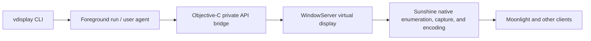

# vdisplay Research and Implementation Design

Research date: 2026-09-22. Status: P0 validated locally; CI, persistent profiles, and per-profile LaunchAgents implemented. The user will perform further hardware validation manually. See [validation results](validation.md) and the [README](../README.md) for current behavior. In-place mode changes and release distribution remain proposals.

## 1. Recommended approach

Use a **Swift CLI, a small Objective-C bridge, and the private CoreGraphics CGVirtualDisplay API**. Start with a foreground single-display tool, then add a user LaunchAgent and control commands, followed by native capture compatibility validation and releases for both architectures.

The product boundary is the system virtual display. Sunshine and other consumers discover, select, and capture it through native macOS interfaces. vdisplay does not manage Sunshine processes, configuration, or session hooks and has no integration-specific subcommands.

Existing open-source implementations establish the feasibility of the basic approach. The main engineering concerns are lifecycle management, OS differences, HiDPI mode semantics, and capture compatibility. A virtual display is not a permanently installed device: the process retaining its object must stay alive.

The initial target is macOS 13+, x86_64 and arm64, with native builds combined into a Universal 2 package. These are targets, not verified support claims. Supported OS releases must be determined by Intel and Apple Silicon hardware validation.

## 2. Implementations reviewed and reuse decisions

| Project | Evidence | Intended use |
| --- | --- | --- |
| [DeskPad](https://github.com/Stengo/DeskPad) | MIT; display creation, HiDPI, and preview implementation | Primary reference for minimal creation and object ownership; exclude its GUI, ReSwift, and capture features |
| [Chromium virtual display utility](https://chromium.googlesource.com/chromium/src/+/fb627eb14f5fff16ce641571ac4b36053a8e22e4/ui/display/mac/test/virtual_display_util_mac.mm) | BSD-style license; display testing infrastructure | Reference private interfaces, OS changes, and lifecycle issues without importing the testing framework |
| [displayplacer](https://github.com/jakehilborn/displayplacer) | macOS display configuration CLI used in Sunshine examples | Reference command design and mode selection; not a virtual display creation backend |
| [VirtualDisplayKit](https://github.com/xocialize/VirtualDisplayKit) | MIT Swift Package derived from DeskPad, including recording, encoding, and UI | Reference module boundaries; avoid a dependency on the full package |
| [BetterDisplay](https://github.com/waydabber/BetterDisplay) | Public product documentation, releases, and feedback | Product reference; its public repository does not grant access to the current commercial implementation |
| [mac-dummy-display](https://github.com/patrikviktor/mac-dummy-display) | Swift example for Sunshine with high refresh rate claims | Supplemental reference, not sufficient evidence for performance or compatibility commitments |

Prefer necessary interface knowledge and small implementation excerpts from DeskPad/Chromium behind our own thin wrapper. Pin revisions and preserve copyright and license text when porting code. No upstream implementation has been copied into this repository during the research phase.

## 3. Technical findings and implications

### Private APIs and OS differences

The core objects are `CGVirtualDisplayDescriptor`, `CGVirtualDisplaySettings`, `CGVirtualDisplayMode`, and `CGVirtualDisplay`. The descriptor defines the display, settings declare modes, and the created object exposes a runtime `displayID`.

Chromium documents nonzero vendor IDs and distinct serial numbers for macOS 14, plus a timing issue during initial display removal. Older code excluded ARM; the reviewed current implementation does not, but still excludes its headless test environment. Neither old examples nor this test utility establish support for a Mac without a logged-in user. [Source](https://chromium.googlesource.com/chromium/src/+/fb627eb14f5fff16ce641571ac4b36053a8e22e4/ui/display/mac/test/virtual_display_util_mac.mm)

Keep private declarations in the bridge. Verify selectors and types on target systems and report missing capabilities. Some DeskPad and Chromium parameter declarations differ; verify the ABI rather than combining headers. Do not preemptively port workarounds that create extra temporary displays. Propose a specific fix only if the issue is reproduced.

### A persistent owner process is required

DeskPad retains its virtual display as an instance property. A creation command cannot immediately exit and expect its display to persist. Saved configuration contains information for recreation, not an object that remains valid across processes. [DeskPad creation code](https://github.com/Stengo/DeskPad/blob/c3349f0e237e000cb4826fb3ea1cdd1c44949461/DeskPad/Frontend/Screen/ScreenViewController.swift)

Foreground `run` and an internal `agent run PROFILE` worker share the same lifecycle implementation. Each enabled profile has its own LaunchAgent in the current user's graphical session. Apple distinguishes per-user agents from system daemons. [Apple launchd documentation](https://developer.apple.com/library/archive/documentation/MacOSX/Conceptual/BPSystemStartup/Chapters/CreatingLaunchdJobs.html)

Initially support an existing graphical login session, including later SSH requests to its agent. Validate operation without physical monitors, screen locking, and sleep recovery separately. Pre-FileVault-unlock operation, operation without a logged-in user, and continued operation with a closed laptop lid are not initial commitments. Do not automatically change login, sleep, or SIP settings.

### Pixels, HiDPI, and refresh rate

CLI `--width/--height` always mean **output pixel dimensions**. `--scale 2` requests half-sized logical dimensions: 3840x2160 pixels correspond to a 1920x1080 desktop. Initially support only scales 1 and 2.

Construct modes using those semantics, then read back actual logical dimensions, pixel dimensions, and refresh rate. A successful API call does not prove that the requested mode is active. Report mismatches and actual state explicitly instead of silently changing resolution. Reject odd dimensions at scale 2.

Use SDR at 60 Hz as the first acceptance baseline. Public claims differ: [SimpleDisplay](https://github.com/SamuelRioTz/SimpleDisplay) states a 60 Hz limit, while [mac-dummy-display](https://github.com/patrikviktor/mac-dummy-display) claims 90/120 Hz. Neither establishes a universal hard limit or universal high refresh rate support. Measure declared refresh rate, system-reported rate, effective new-frame rate, and encoder frame rate separately.

Leave HDR, VRR, and end-to-end 120 Hz performance for subsequent investigation. Do not preemptively add periodic drawing or CVDisplayLink mechanisms to force frames.

### System content and downstream capture

Creating a `CGVirtualDisplay` registers a display output with the system. WindowServer manages desktop composition and display content. We retain the display object and configure its modes; we do not implement an application-side framebuffer, IOSurface queue, or shared-memory protocol for desktop images. Capture consumers obtain image buffers through system APIs.

The reviewed Sunshine revision parses numeric display selectors as `CGDirectDisplayID` and captures through `AVCaptureScreenInput`, initializing capture dimensions from the display mode's pixel size. Do not assume it already uses ScreenCaptureKit. [Display selection](https://github.com/LizardByte/Sunshine/blob/c48e50e418b27cba2b387c3a1ae9605da8a96341/src/platform/macos/display.mm), [capture implementation](https://github.com/LizardByte/Sunshine/blob/c48e50e418b27cba2b387c3a1ae9605da8a96341/src/platform/macos/av_video.m)

Sunshine documents display IDs for macOS `output_name`. Discovering a new display does not automatically select it. Selection and re-enumeration belong to Sunshine; users configure them in the consuming application. [Configuration documentation](https://github.com/LizardByte/Sunshine/blob/master/docs/configuration.md)

Our responsibilities are limited to:

1. Make the created display available through native enumeration, confirm its mode is ready, and keep it alive until the user stops it.
2. Expose its name, current display ID, and actual mode through generic `list/status`. Use persistent profile UUIDs and serial numbers internally; runtime IDs may change after recreation.
3. Validate native discovery and capture with a representative consumer such as Sunshine, without generating configuration or managing reloads, startup, or sessions.
4. Leave recording and input permissions to Sunshine. The initial vdisplay implementation does not capture content. Do not inherit DeskPad's preview-related permission requirements without checking what this CLI actually requires on hardware.

## 4. Initial scope and architecture

The minimum useful release creates one extended virtual display with a chosen name, dimensions, and scale in a user's graphical session. It exposes actual properties, reliably retains and removes the display, and permits Sunshine capture.

Support requesting and reading back SDR 60 Hz modes at 1080p, 1440p, 4K, and custom dimensions. Custom dimensions are not unlimited: report system rejection explicitly. Validate one display first, while allowing the data model to hold multiple profiles; simultaneous multi-display support comes later.



Suggested modules:

| Module | Responsibility |
| --- | --- |
| `VirtualDisplayBridge` | Private Objective-C declarations, display creation and mode application, object ownership and release, stable Swift-facing interface |
| `DisplayCore` | Argument parsing, configuration validation, persistent profiles, file leases, LaunchAgent definitions/control, lifecycle state, and errors |
| `vdisplay` | Output, native display inspection, foreground execution, and background profile workers |

Use Swift Package Manager with separate Swift and Objective-C targets. The P0 implementation links Foundation/CoreGraphics, uses AppKit for display names, and SystemConfiguration for console-user inspection. It uses a small strict Swift argument parser so parsing can be tested without touching display APIs. Do not introduce Python, Node, Rust, or a third-party virtual display runtime. If a larger CLI warrants Apple ArgumentParser later, request dependency installation first.

The implemented background design replaces the proposed single agent and Unix socket with one LaunchAgent owner per profile. This isolates the CoreGraphics mode cache across creation cycles and uses launchd's lifecycle controls instead of a custom server. `agent install` copies the executable to a stable application-support path. `start` writes a profile-specific plist and bootstraps or explicitly kickstarts the job; `stop` boots it out and removes the login definition. Commands pass argument arrays without a shell. No Sunshine process is managed.

Store versioned configuration in `~/Library/Application Support/vdisplay/` with atomic writes, 0700 private directories, and 0600 data files. A control file lease serializes CLI mutations; each owner holds a separate profile lease until cleanup ends. Runtime state is separate from configuration. Status combines state with lease liveness so an exited process's saved display ID is not treated as active. Persistent UUID/serial identities are allocated when profiles are added. Configuration decoding rejects invalid modes and duplicate identities rather than repairing them.

Lifecycle states are `creating -> ready -> removing -> stopped`; failures report observed state. Confirm completion through bounded state readback rather than fixed sleeps. P0 registers display notifications after creation: registering before creation caused missing mode readback on the validation host. Readback covers missed add events. Release objects allocated by a failed creation attempt as operation cleanup. Report removal timeouts rather than claiming the display disappeared.

LaunchAgent installation, startup, shutdown, and removal require explicit commands. Queries must not silently install services. An enabled profile's plist uses `RunAtLoad` to restore its display at the next graphical login and `KeepAlive = false` to avoid crash restart loops. A failed start remains enabled until explicitly stopped. Stop preserves the profile; uninstall preserves configuration/logs and refuses while profiles are enabled or running.

Initial exclusions: GUI, previews, encoding, network remote control, physical display disabling, mirroring, brightness/DDC, automatic primary-display changes, and Sunshine configuration management.

## 5. Proposed CLI

The foreground and background commands below are implemented. Runtime mode editing remains deferred.

First phase:

```sh
# Retain the display in the foreground; release it on Ctrl-C or SIGTERM.
vdisplay run --name "Sunshine Display" --width 2560 --height 1440 --scale 1 --refresh 60

# 4K output with a 1920x1080 logical desktop.
vdisplay run --name "Retina Remote" --width 3840 --height 2160 --scale 2 --refresh 60

vdisplay list --json
vdisplay doctor
```

After confirming readiness, `run` prints the current display ID and actual mode, then stays alive. `list` enumerates system displays and marks ownership only where it can be established. Never destroy another application's display based on its name or an arbitrary numeric ID. `doctor` checks OS/architecture, API classes/selectors, and session conditions without creating displays or recording content by default.

Second phase:

```sh
vdisplay profile add remote --name "Sunshine Display" --width 2560 --height 1440 --scale 1 --refresh 60
vdisplay agent install
vdisplay start remote --wait
vdisplay status remote --json
vdisplay stop remote --wait
vdisplay profile remove remote
vdisplay agent uninstall
```

Profile aliases must be unique. Starting an already active profile returns current state without duplicating it. Start/stop wait for owner readiness/shutdown, with explicit `--wait` also accepted. The proposed `set` command is not implemented. Replace configuration by stopping and removing/re-adding the profile; this assigns a new identity. In-place mode changes require a separate implementation decision.

Commands operate on displays, do not read Sunshine-specific environment variables, and do not automatically tie display lifetimes to streaming sessions. Users can call the generic CLI from external automation.

Use stdout for results or JSON and stderr for progress and errors. JSON must distinguish profile UUID, runtime display ID, requested/actual pixel dimensions, actual logical dimensions, scale, refresh rate, and state. Proposed exit codes: 0 success, 2 invalid arguments, 3 unsupported environment/API, 4 unavailable agent/session, 5 display operation failure/timeout.

## 6. Architectures and distribution

Use one codebase for arm64 and x86_64. Running through Rosetta is not native Intel hardware coverage. Develop with a single-architecture build, then build both targets, combine them into Universal 2, and sign the result for release. Record Xcode/SDK versions and confirm support for both targets rather than assuming the newest local SDK covers every deployment target.

Initially distribute source and CLI archives through GitHub Releases; add a Homebrew formula after stabilization. Plan Developer ID signing and notarization for general distribution. Developer accounts and signing material are release-stage dependencies. No dependencies have been installed and no builds, signing, or releases have been performed during this research phase.

Retain the existing GPLv3 LICENSE. Include applicable attribution and licenses when redistributing MIT/BSD source. Upstream license text governs reuse; this design grants no additional rights.

## 7. Implementation phases and acceptance criteria

| Phase | Deliverables | Acceptance criteria |
| --- | --- | --- |
| P0: Minimal foreground tool | Package.swift, bridge, run/list/doctor, explicit errors | Create SDR 1080p60 locally, confirm native enumeration and mode readback, remove on exit |
| P1: Modes and architectures | Custom dimensions, scales 1/2, persistent profile identity design, builds for both architectures | Validate 1080p/1440p/4K modes and lifecycles on Intel and Apple Silicon; explicitly mark unavailable hardware coverage as pending |
| P2: Background lifecycle | Per-profile LaunchAgents, persistent profiles, start/stop/status; set deferred | Controller/storage tests pass; manual validation must confirm terminal independence, stop cleanup, and login restoration |
| P3: Consumer compatibility | Native discovery/capture records for pinned Sunshine/Moonlight versions | Consumer enumerates and selects the display; image, dimensions, and mouse mapping are correct without vdisplay managing consumer processes/configuration |
| P4: Release | Universal 2, signing/notarization, install/uninstall instructions, compatibility table | Clean user environment can install and run; package includes notices; documentation lists only validated capabilities |

P0 is complete on the local validation host. At the user's request, CI and background persistence were implemented before further P1 hardware coverage. P1 and actual LaunchAgent/display behavior are reserved for manual validation. Accepting scale 1/2 and custom dimensions does not establish the full compatibility matrix.

The following is the overall validation plan; [the validation record](validation.md) distinguishes completed checks from pending coverage:

- Architectures/OS: native Intel and Apple Silicon; macOS 13, 14, 15, and 26 as hardware permits. Record the local macOS 27 separately; it does not establish compatibility with older systems.
- Modes: 1920x1080, 2560x1440, 3840x2160, scales 1/2, non-16:9 and portrait dimensions, invalid arguments, and rejected modes with appropriate exit codes.
- Lifecycle: repeated creation/removal, SIGTERM, system cleanup after forced exit, sleep/wake, logout/login, and queries that do not rely on stale display IDs.
- Sessions: physical display attached, logged-in headless operation, lock screen, and SSH requests to an existing agent. Record each result separately.
- Streaming: pinned Sunshine/Moonlight versions, native enumeration and selection, captured dimensions, absolute pointer coordinates, effective dynamic frame rate, CPU/GPU use, and reconnection. Observe compatibility without managing sessions.
- Use focused checks for parsing/IPC during implementation. Schedule WindowServer validation with its display effects clearly stated; do not add tests for documentation-only changes.

## 8. Risks and open validation items

| Issue | Current assessment | Approach |
| --- | --- | --- |
| Private APIs change with OS updates | Ongoing maintenance cost; future versions are not guaranteed | Isolate the bridge, pin references, diagnose capabilities, and report explicit errors |
| Intel and ARM differences | Shared architecture is plausible; project hardware validation is pending | Build and record hardware results separately |
| Asynchronous removal issues | Chromium documents related problems | Reproduce and record before adding a workaround |
| Headless and logged-out operation are confused | Logged-in headless use needs validation; logged-out operation is outside initial scope | State session prerequisites and use a user LaunchAgent |
| 4K/HiDPI/high refresh resource use | Depends on GPU, OS, capture, and encoding | Read back actual modes and measure end-to-end behavior |
| Consumer selects another display | Discovery differs from selection; runtime IDs can change | Expose current IDs through generic inspection; selection belongs to the consumer |
| Conflicting 60/120 Hz claims | Mode parameters alone cannot settle the question | Deliver 60 Hz first and investigate higher rates separately |

No open issue blocks the design direction. Access to Intel hardware for a verified support claim remains unconfirmed.

## 9. Sources and research record

Core source files were inspected at these revisions:

- DeskPad: `c3349f0e237e000cb4826fb3ea1cdd1c44949461`; [creation](https://github.com/Stengo/DeskPad/blob/c3349f0e237e000cb4826fb3ea1cdd1c44949461/DeskPad/Frontend/Screen/ScreenViewController.swift), [private declarations](https://github.com/Stengo/DeskPad/blob/c3349f0e237e000cb4826fb3ea1cdd1c44949461/DeskPad/CGVirtualDisplayPrivate.h), [MIT license](https://github.com/Stengo/DeskPad/blob/c3349f0e237e000cb4826fb3ea1cdd1c44949461/LICENSE.md).
- Chromium: `fb627eb14f5fff16ce641571ac4b36053a8e22e4`; [display utility](https://chromium.googlesource.com/chromium/src/+/fb627eb14f5fff16ce641571ac4b36053a8e22e4/ui/display/mac/test/virtual_display_util_mac.mm), [license](https://github.com/chromium/chromium/blob/fb627eb14f5fff16ce641571ac4b36053a8e22e4/LICENSE).
- Sunshine: `c48e50e418b27cba2b387c3a1ae9605da8a96341`; macOS display and capture sources linked above. Neither master documentation nor this revision proves compatibility with an installed release; record actual binary versions during validation.
- Other references were reviewed at README/product-documentation level, not comprehensively audited. Links were accessed on 2026-09-22.

The repository initially contained only README and GPLv3 LICENSE, with a clean working tree. Research added collaboration guidelines, ignore rules, this design, and an updated README. No Python was used, dependencies installed, virtual displays created, or Sunshine/system display settings changed.

Initial read-only environment inspection: `arm64`, macOS `27.0` (`26A428`), Xcode developer directory `/Applications/Xcode.app/Contents/Developer`. That research did not validate builds or display functionality; subsequent implementation results are recorded separately in [validation.md](validation.md).
